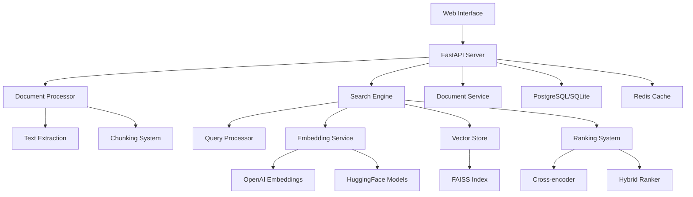

# Document Q&A Engine 📚

A high-performance, searchable document question-answering system with advanced embeddings, intelligent ranking, and real-time search capabilities.

## 🌟 Features

### Core Capabilities
- **Multi-format Support**: PDF, DOCX, and text file processing
- **Advanced Text Extraction**: Robust parsing with fallback methods
- **Intelligent Chunking**: Smart text segmentation with overlap
- **Vector Embeddings**: Multiple embedding providers (OpenAI, HuggingFace)
- **Hybrid Search**: Combines semantic search with traditional ranking
- **Cross-encoder Reranking**: Improved relevance scoring
- **Query Processing**: Advanced query understanding and expansion
- **Real-time Search**: Sub-second response times
- **Web Interface**: Beautiful Streamlit-based UI
- **REST API**: Full-featured FastAPI backend

### Performance & Scalability
- **FAISS Integration**: High-performance vector similarity search
- **Caching Layer**: Redis-based caching with memory fallback
- **Batch Processing**: Efficient document ingestion
- **Async Architecture**: Non-blocking operations
- **Background Tasks**: Asynchronous document processing

### Enterprise Features
- **Analytics Dashboard**: Search performance and usage metrics
- **Document Management**: Full CRUD operations
- **Query Suggestions**: Smart autocomplete
- **Feedback System**: User feedback collection
- **Health Monitoring**: System status and diagnostics

## 🏗️ Architecture



## 🚀 Quick Start

### Prerequisites
- Python 3.8+
- pip or conda
- Optional: OpenAI API key for better embeddings
- Optional: Redis for production caching

### Installation

1. **Clone the repository:**
```bash
git clone <repository-url>
cd "DocQuery AI"
```

2. **Install dependencies:**
```bash
pip install -r requirements.txt
```

3. **Configure environment:**
```bash
cp .env.example .env
# Edit .env with your configuration
```

4. **Start the API server:**
```bash
python run_api.py
```

5. **Start the web interface:**
```bash
# In a new terminal
python run_streamlit.py
```

6. **Access the application:**
   - Web Interface: http://localhost:8501
   - API Documentation: http://localhost:8000/docs
   - API Health Check: http://localhost:8000/health

## 📖 Usage Guide

### Document Upload
1. Navigate to the "Upload Documents" page
2. Select PDF, DOCX, or text files
3. Click "Upload Documents"
4. Wait for processing to complete

### Searching Documents
1. Go to "Search Documents" page
2. Enter your question in natural language
3. Optionally select specific documents
4. Click "Search" to get answers

### Advanced Features
- **Query Suggestions**: Auto-complete based on search history
- **Document Filtering**: Search within specific documents
- **Analytics**: View search performance and popular queries
- **Document Management**: View, organize, and delete documents

## 🔧 Configuration

### Environment Variables

| Variable | Description | Default |
|----------|-------------|----------|
| `OPENAI_API_KEY` | OpenAI API key for embeddings | None |
| `EMBEDDING_MODEL` | HuggingFace model name | `sentence-transformers/all-MiniLM-L6-v2` |
| `VECTOR_DB_TYPE` | Vector database type | `faiss` |
| `DATABASE_URL` | Database connection string | `sqlite:///./docqa.db` |
| `REDIS_URL` | Redis connection string | `redis://localhost:6379` |
| `MAX_FILE_SIZE_MB` | Maximum file size | `50` |
| `CHUNK_SIZE` | Text chunk size | `1000` |
| `SEARCH_TOP_K` | Initial search results | `20` |
| `RERANK_TOP_K` | Final reranked results | `5` |

### Model Configuration

#### Embedding Models
- **OpenAI**: `text-embedding-3-small` (1536 dimensions)
- **HuggingFace**: `sentence-transformers/all-MiniLM-L6-v2` (384 dimensions)
- **Custom**: Any sentence-transformers compatible model

#### Reranking Models
- **Default**: `ms-marco-MiniLM-L-6-v2`
- **Alternatives**: Any cross-encoder model from HuggingFace

## 🔌 API Reference

### Document Endpoints
- `POST /documents` - Upload document
- `GET /documents` - List documents
- `GET /documents/{id}` - Get document details
- `DELETE /documents/{id}` - Delete document
- `GET /documents/{id}/chunks` - Get document chunks

### Search Endpoints
- `POST /search` - Search documents
- `GET /search/suggestions` - Query suggestions

### Analytics Endpoints
- `GET /analytics/stats` - System statistics
- `GET /analytics/popular-queries` - Popular queries

### Admin Endpoints
- `GET /health` - Health check
- `POST /admin/clear-cache` - Clear cache
- `POST /feedback` - Submit feedback

## 📊 Performance Optimization

### Search Latency
- **Query Processing**: ~10-50ms
- **Vector Search**: ~50-200ms
- **Reranking**: ~100-500ms
- **Total Search Time**: Usually <1000ms

### Optimization Tips
1. **Use OpenAI embeddings** for better quality
2. **Enable Redis caching** for production
3. **Tune chunk size** based on document types
4. **Adjust search parameters** for speed vs accuracy
5. **Use GPU acceleration** for embedding models

### Scaling Considerations
- **Horizontal Scaling**: Multiple API instances
- **Database**: PostgreSQL for production
- **Vector Store**: Consider Pinecone/Weaviate for large scale
- **Caching**: Redis cluster for high availability

## 🧪 Testing

### Run Tests
```bash
pytest tests/ -v
```

### Test Coverage
```bash
pytest --cov=app tests/
```

### Load Testing
```bash
# Install locust
pip install locust

# Run load tests
locust -f tests/load_test.py --host=http://localhost:8000
```

## 📈 Monitoring

### Health Checks
- API Health: `GET /health`
- Database connectivity
- Vector store status
- Embedding service availability

### Metrics
- Search latency percentiles
- Document processing times
- Cache hit rates
- Error rates and types

### Logging
- Structured logging with Loguru
- Configurable log levels
- Request/response tracking
- Performance metrics

## 🔒 Security

### API Security
- Input validation and sanitization
- File type and size restrictions
- Rate limiting (configurable)
- CORS configuration

### Data Security
- Content hash-based deduplication
- Secure file storage
- Database connection encryption
- Optional API authentication

## 🚀 Deployment

### Docker Deployment
```bash
# Build image
docker build -t docqa-engine .

# Run container
docker run -p 8000:8000 -p 8501:8501 docqa-engine
```

### Production Checklist
- [ ] Set production environment variables
- [ ] Configure PostgreSQL database
- [ ] Setup Redis cluster
- [ ] Enable HTTPS
- [ ] Configure monitoring
- [ ] Setup backup strategy
- [ ] Load balancer configuration

## 🤝 Contributing

1. Fork the repository
2. Create a feature branch
3. Make your changes
4. Add tests
5. Run the test suite
6. Submit a pull request

### Development Setup
```bash
# Install development dependencies
pip install -r requirements-dev.txt

# Install pre-commit hooks
pre-commit install

# Run code formatting
black app/ tests/
isort app/ tests/

# Run linting
flake8 app/ tests/
```

## 📄 License

This project is licensed under the MIT License - see the LICENSE file for details.

## 🙏 Acknowledgments

- **HuggingFace**: Sentence transformers and models
- **FAISS**: Efficient similarity search
- **OpenAI**: High-quality embeddings
- **FastAPI**: Modern web framework
- **Streamlit**: Beautiful web interfaces
- **SQLAlchemy**: Database ORM

## 📞 Support

For support, please:
1. Check the documentation
2. Search existing issues
3. Create a new issue with detailed information
4. Contact the development team